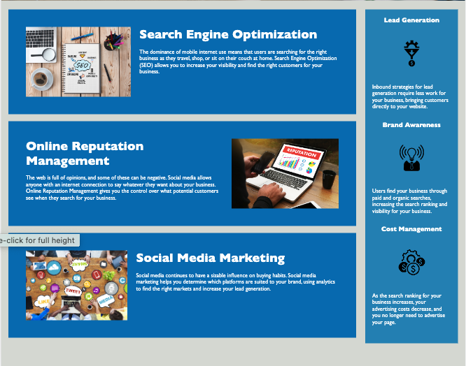

# Horiseon Marketing Agency

## Description
Horiseon Marketing Agency is a project aimed at optimizing the website for search engines while ensuring it meets accessibility standards.
Motivation: The primary motivation behind this project was to enhance the website's accessibility, ensuring that it's usable by as many people as possible, including those with disabilities.
Purpose: This project was built to improve the website's SEO and ensure it adheres to accessibility standards, making it more user-friendly and optimized for search engines.
Problem it solves: It addresses the challenge of making websites accessible to all users, including those with disabilities, while also optimizing for search engines.
Learnings: Through this project, I learned the importance of semantic HTML elements, the significance of alt attributes in images, the need for logical structure in HTML independent of styling, and the value of a descriptive title.

## Installation
Clone the repository to your local machine.
Navigate to the project directory.
Open index.html in your preferred browser.

## Usage
The Horiseon Marketing Agency website provides information on various marketing services, including Search Engine Optimization, Online Reputation Management, and Social Media Marketing. 

The link to the deployed application is here https://isaacmasterman.github.io/M01C/ 

## License
This project is licensed under the MIT License.
